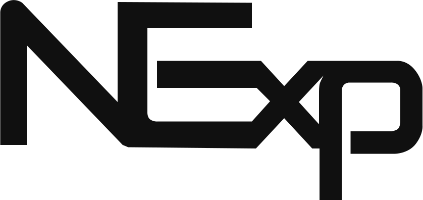

# Welcome to Node Experience!

[](https://circleci.com/gh/DigiChanges/node-experience/tree/master)
[](https://github.com/DigiChanges/node-experience/blob/master/LICENSE)

<div style="text-align:center">
    
</div>

## Basic Description
Hello! **NExp** *(Node Experience)* is a boilerplate for [**Node**](https://nodejs.org/en/), which makes use of a Clean Architecture + DDD, with [**TypeScript**](https://www.typescriptlang.org/) that combined allow a perfect cohesion thus achieving a clean and at the same time very powerful implementation.

## Base project

https://github.com/DigiChanges/node-experience

## Docs

### Boilerplate Documentation

[Boilerplate Documentation](https://digichanges.github.io/nexp-docs)

*NOTE*: The v1 it's deprecated and don't have support in the future.

## Quick Start

We can run the project directly with docker compose and then bash where the basic commands to feed the database are located.

1. git clone https://github.com/DigiChanges/node-experience
2. Create a folder on project root call it `dist`.
3. Install dependencies. `pnpm install`.
4. Copy `.env.dev` file to `.env`. (**.env.dev** it's an environment example file)
5. Then execute `STAGE=dev docker-compose up --build` to up all containers.
6. Configure Keycloak.

#### Creation of realm and client in Keycloak
Once you already login in the keycloak administration console, you can create the realm from the side menu


Then you just need to add a name to it and click on "Create".


To add a client, first you need to select the realm, then go to the side menu "Clients", you will see the option "Create client".


Complete the required fields and then click on "Next", after finish all the steps then you can save it.


NOTE: In **docker/keycloak/themes** folder you can find a theme for keycloak, you can use it to customize the login page.
      It's made with https://github.com/keycloakify/keycloakify

You need to select the new client and on credential tab copy the client secret and copy UUID client from URL.

Go to .env file and replace this values.

Example: 

```
KEYCLOAK_CLIENT_ID=experience
KEYCLOAK_CLIENT_SECRET=eSKReacL00dAjlrQfv5HM8BWLcCDmkCK
KEYCLOAK_CLIENT_UUID=4693fe5e-4d33-43a0-b016-e19e827ca332
```

And .env file complete this is like this:

```
KEYCLOAK_CLIENT_ID=experience
KEYCLOAK_CLIENT_SECRET=eSKReacL00dAjlrQfv5HM8BWLcCDmkCK
KEYCLOAK_CLIENT_UUID=4693fe5e-4d33-43a0-b016-e19e827ca332
KEYCLOAK_MAIN_REALM=chespirito
KEYCLOAK_HOST=http://keycloak:8080
KEYCLOAK_USERNAME=superadmin@node.com
KEYCLOAK_PASSWORD=db_experience123
KEYCLOAK_AUTHORIZATION=true
```


5. Finally, generates an **admin user**, add **roles** with **permissions** and get a **bucket** for **MinIO**. 

`docker-compose exec node bash dev.init.sh`

## Installation

First, install nexp-cli using [npm](https://www.npmjs.com/) (we assume you have pre-installed [node.js](https://nodejs.org/)).

```bash
npm install -g nexp-cli
```

Then generate your new project:

```bash
nexp-cli create
```

Each module is divided by business domain:

- File
- Item
- Notification

There are also two particular cases:

- Config
- Shared

The directory structures for business domains are as follows: 

**Folder structure of a domain (business logic)**

```sh 
├── Domain
│   ├── Entities
│   ├── Exceptions
│   └── Services
│   └── UseCases
├── Infrastructure
│   ├── Repositories
│   ├── Schema
│   └── Seeds
├── Presentation
│   ├── Commands
│   ├── Controllers
│   ├── Criterias
│   ├── Exceptions
│   ├── Handlers
│   ├── Middlewares
│   ├── Requests
│   └── Transformers
├── Tests
│   ├── Fixtures
 ```

---

> **Tip** I know it may sound repetitive, but it is not a framework. NExp is a set of tools or libraries working together through a common structure. All structural code within this project is not fixed and can be changed freely.

## Advantages

The advantages of using this boilerplate is to save time thinking about certain basic structures common to any project to make an API without having to get everything from scratch. 

As it is only a boilerplate, you have the freedom to structure the code whatever you want.

Common structures found within this project are: 

- Authentication and authorization with [Keycloak](https://www.keycloak.org).
- Filesystem with [MinIO](https://min.io), 100% S3 compatible.
- Basic push Notification and Email with nodemailer.
- MikroORM and Mongoose Integration.
- Koa integration.
- Business logic independent of the HTTP and persistence libraries.

## License

**NExp** is [MIT licensed](LICENSE).
